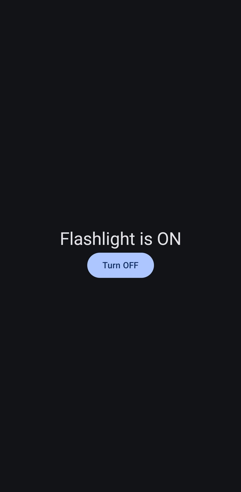
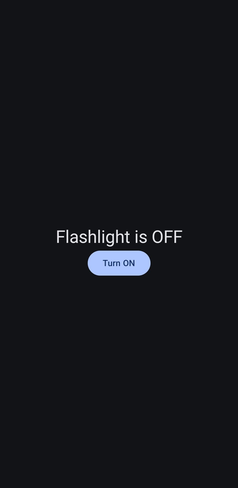

# 🔦 Flashlight App for Android

A simple yet powerful flashlight/torch application built with **Kotlin** and **Jetpack Compose** for Android devices.

## 📱 Features
- One-tap toggle for flashlight ON/OFF
- Material Design 3 UI with clean interface
- Works on Android 6.0+ (API 23+)
- Light/dark theme support
- Real-time status indicator

## 🛠️ Technologies Used
- **Kotlin** - Primary programming language
- **Jetpack Compose** - Modern UI toolkit
- **Camera2 API** - For flashlight control
- **Material Design 3** - For beautiful UI components

## 📸 Screenshots
| Light Theme | Dark Theme |
|-------------|------------|
|  |  |

## ⚙️ Requirements
- Android 6.0 (Marshmallow) or higher
- Device with camera flash hardware
- Camera permission

## 🚀 Installation
1. Clone the repository:
   ```bash
   git clone https://github.com/yourusername/FlashlightApp.git
2. Open in Android Studio

3. Build and run on your device/emulator

🔧 Permissions
This app requires:

xml
<uses-permission android:name="android.permission.CAMERA" />
<uses-feature android:name="android.hardware.camera.flash" />

📝 Code Structure
/com.example.flashlightapp
├── /ui
│   ├── MainActivity.kt       # Main entry point
│   └── theme/               # Theme configuration
├── /model
│   └── FlashlightManager.kt  # Flashlight logic
└── AndroidManifest.xml
🤝 Contributing
Pull requests are welcome! For major changes, please open an issue first.

📜 License
MIT